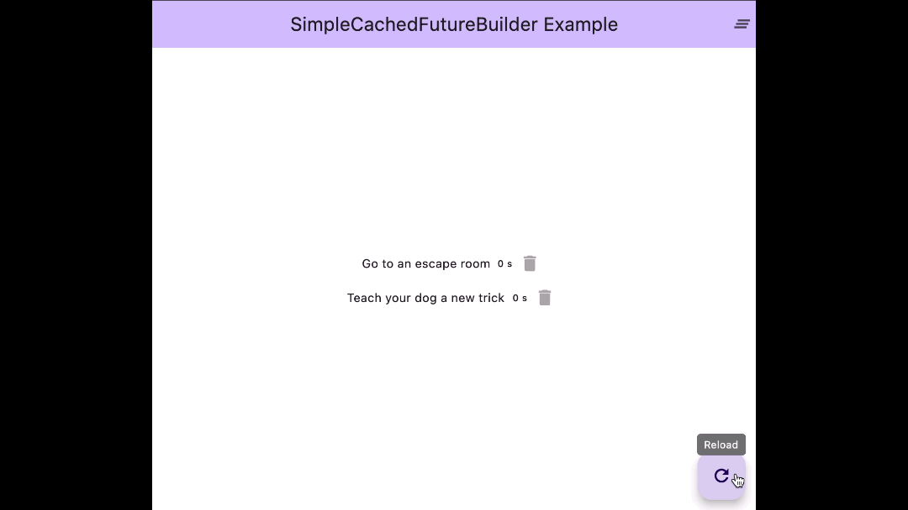

A simplified `FutureBuilder` with basic caching abilities.

Created to solve three issues:
1. Avoid the need to check `if (snapshot.connectionState == ConnectionState.done && snapshot.hasData)` for each `FutureBuilder`.
2. Avoid the future method to be called on each build without manually storing it as a variable.
3. Allow the value to be cached during a session for quicker retrieval.



## Features

- Use the class to **simplify the process** of building a widget after some data have been fetched. Fewer lines of code will need to be written in the most basic cases.
- Optionally: Cache the fetched data so that **less calls will be made** on  `build()`, especially during development when you need to rebuild a lot.
- Optionally: **Manage the cached data** either using the default manager or using your own class. Can easily be used with any database package to store the data more permanently.

## Getting started

Add `simple_cached_future_builder` as a [dependency in your pubspec.yaml file](https://flutter.dev/using-packages/).

## Usage

### Basic usage
```dart
SimpleCachedFutureBuilder<String>(
    future: get(Uri.parse('https://www.boredapi.com/api/activity'))
            .then((value) => value.body),
    builder: (context, body) {
        return Text(jsonDecode(body)['activity']);
    },
)
```
Compared to a `FutureBuilder`, you will not have to return a widget while loading or if there is an error. You might in other words be able to drop a few lines of code that you might be repeating a lot (as was the case for me). To add a loading or error widget, see [all options](#all-options).

```diff
FutureBuilder<String>(
    future: get(Uri.parse('https://www.boredapi.com/api/activity'))
        .then((value) => value.body),
    builder: ((context, snapshot) {
-        if (snapshot.connectionState == ConnectionState.done && snapshot.hasData) {
            return Text(jsonDecode(snapshot.data!)['activity']);
-        } else {
-            return Container();
-        }
    }),
),
```
### All options
```dart
SimpleCachedFutureBuilder<String>(
    future: get(Uri.parse('https://www.boredapi.com/api/activity'))
        .then((value) => value.body),
    builder: (context, activityResponse) {
        var activityData = jsonDecode(activityResponse);
        return Text(activityData['activity']);
    },
    onLoadingWidget: const CircularProgressIndicator(),
    onErrorWidget: (error) => const Icon(Icons.warning),
    cache: SimpleCache(
        tag: 'activitySuggestion',
        validFor: const Duration(minutes: 3)),
    cacheManager: MyCustomCacheManager(),
)
```
| Parameter | Example | Description |
|:---|:---|:---|
| `future` | `get(Uri.parse('https://www.boredapi.com/api/activity'))` | **_Required_** A future value. |
| `builder` | `builder: (context, activityResponse) => Text(activityResponse)` | **_Required_** A method that returns the fetched data. Must return a widget. |
| `onLoadingWidget` | `onLoadingWidget: const CircularProgressIndicator()` | *Optional* The widget to be displayed while loading. |
| `onErrorWidget` | `onErrorWidget: (error) => const Icon(Icons.warning)` | *Optional* A widget to appear if fetching the data fails or the value is `null`. |
| `cache` | `SimpleCache(tag: 'activitySuggestion', validFor: const Duration(minutes: 3))` | *Optional* Cache the value for a period of time. |
| `cacheManager` | `BasicCacheManager()` | *Optional* A manager to handle the cache, for instance to manually clear the cache or to cache it between sessions. |


## Custom `CacheManager`
The cache manager can be overridden to handle the cache in some other way than the default manager, `BasicCacheManager()`.

```dart
class MyCustomCacheManager extends CacheManager {
  @override
  void clearCache() {
    // TODO: Clear database
  }

  @override
  Future<bool> exists(SimpleCache tag) async {
    // TODO: Check if value exists
  }

  @override
  void removeCache(SimpleCache tag) {
    // TODO: Delete cache
  }

  @override
  retrieveCache(SimpleCache tag) {
    // TODO: Retrieve cache
  }

  @override
  void storeCache(SimpleCache tag, data) {
    // TODO: Store cache
  }
}
```


## Additional information

Note that the default cache manager stores the data in a `Map`. This means all that the data will be cleared each time your app is fully restarted.

Also note that this could potentially lead to high memory usage if you cache a lot of different large values. 

The default manager is intended for temporary small data that does not need to be kept over different sessions. For all other usages it is recommended to use a [CustomCacheManager](#custom-cachemanager). See the `example/lib/main.dart` for an example implementation using [Hive](https://pub.dev/packages/hive).
